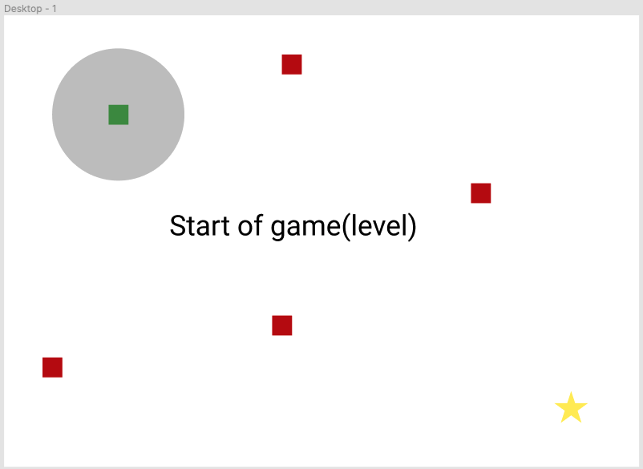
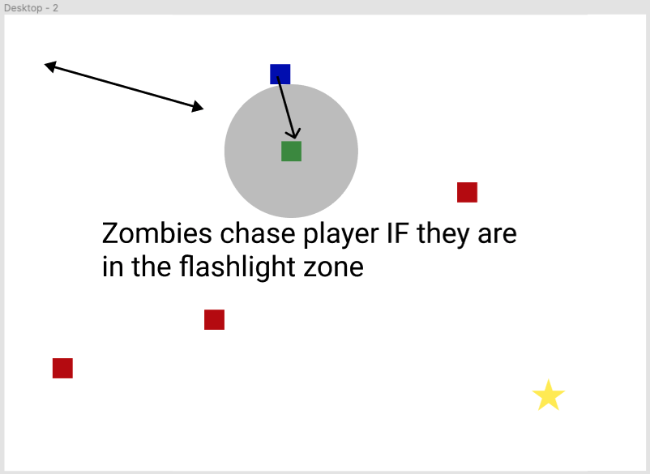
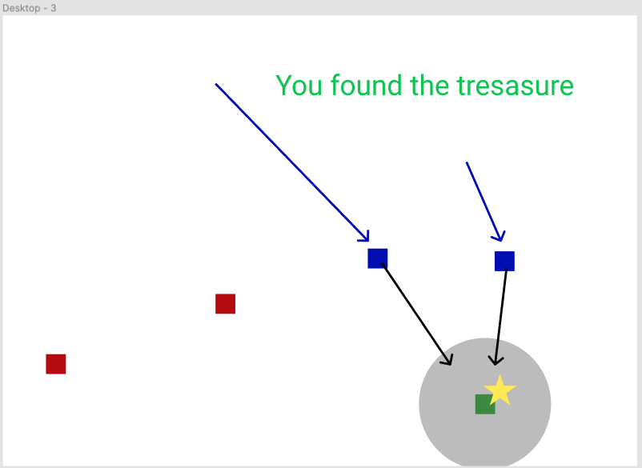
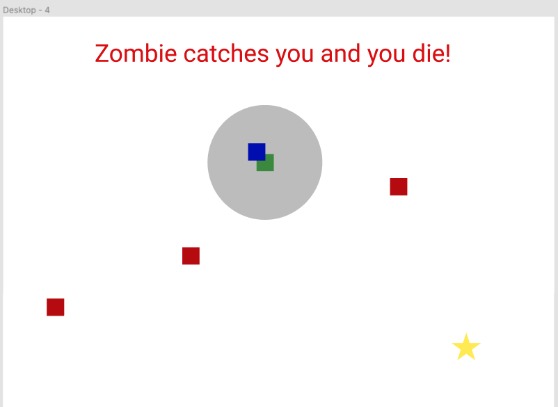

# Zombie_Runner
> A game where the hero is tasked to find the treasure and avoid the zombies!
___
## Overview
The user of the game plays as a survivor in a post-apocoliptic, zombie infested, landscape. The survivor is tasked with venturing into the world to find valuable items in order to stay alive.

I am building this game to learn more about and practice: HTML canvas, OOP, game developement, and a challenge.

## Game Rules
 1. The gameboard contains:
    - The survivor
    - Zombies!
    - A hidden valuable
    - Stretch: Obstacles, Power-Ups
2. The User uses the **arrow-keys** to move the survivor around the board
3. The survivor has a **limited view** of the gameboard through using a **flashlight**
4. The task of the survivor is to **find the hidden valuable**
5. If the survivor finds a zombie, the **zombie will chase the survivor** for the remainder of the level. Otherwise the **zombies will not chase the survivor**
6. If the **zombie catches the survivor**, the **survivor dies** and the User loses the game
7. If the **survivor finds the hidden valuable**, the **User wins the level**

## Wireframes
> At the beggining of the game, the user will only be able to see the survivor (*green square*) and a short radius around them (*gray circle*). The gameboard will contain multiple zombies (*red squares*), and a hidden valuable (*star*) for the survivor to find.

> As the survivor moves around the gameboard they may encounter some zombies. If a zombie is within the survivors flashlight, the zombie will begin chasing the survivor.

> As the survivor searches the gameboard for the valuable item, the survivor may find more zombies which will join the persuit. If the survivor can get the valuable item before the zombie gets them, the survivor wins the level!

> If a zombie catches the survivor, the survivor is killed

## User Stories
- When I load the page, I see a black gameboard and a start button. I also see a text block that explains the goal of the game and how to play.

- When I start the game, my player appears and the player flashlight shows a radius around the player. I can then start moving around the game.

- As I move the player around the board, zombies come into my view. The zombies aren't moving. If I collide with a zombie, I die, a 'GAME OVER' message appears and I can't move my player.

- As I move the player around the board, I can find valuables. If I collide with a valuable, the game ends, I see a 'YOU WIN' message.

## MVP Checklist
- [x] Create a static gameboard using HTML, CSS, Canvas
- [x] Create a class for squares representing the player, zombies, and valuables
    - [x] (x, y, w, h, color) render method
    - [x] Create the survivor
- [x] Add an eventListeners to keyboard arrows and impliment logic to get the player moving around the screen
- [x] Impliment a game loop (fps)
    - [x] The loop clears the screen and re-renders the objects on the screen
    - [x] Display survivor position(x, y) in console
- [x] Create a Zombie class that extends Rectangle class
    - [x] Create a few zombies
- [] Create a handleCollision function
    - [] Handle collisions with zombies
        - [] If survivor collides with zombie => you lose!
    - [] Handle collisions with valuables
        - [] If survivor collides with valuable => you win!
- [] Impliment the 'flashlight'
    - [] Flashlight radius is centered around player
    - [] Gameboard is black outside flashlight radius
- [] Create a start button to initialize the game view and start the game loop.

## Stretch Goals
- [] Zombies chase the survivor!
- [] CSS background
- [] Add some sweet character icons in place of the lame squares
- [] Create multiple levels with an object of levels
    - [] numZombies, zombieLocations, numValuables, valuableLocations
- [] Background music
- [] Obstacles
